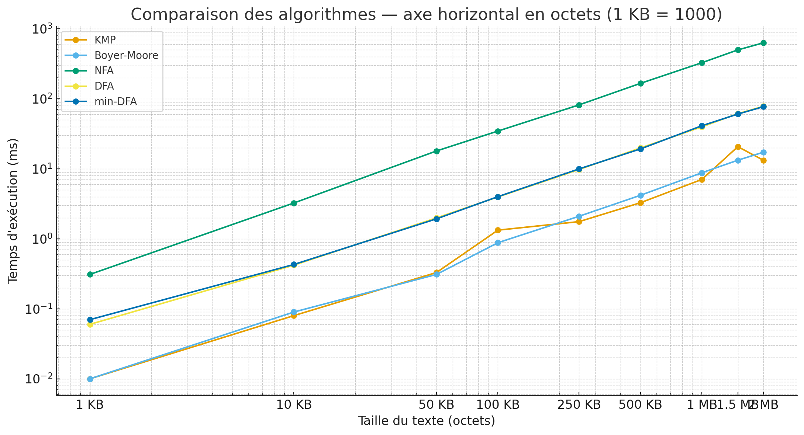

# 5. Résultats et Analyse de Performance

Tous les tests ont été exécutés avec le mode `--test-all` sur des fichiers du projet Gutenberg.

## 5.1 Patterns Littéraux Courts vs Longs

### 5.1.1 Pattern Court ("the") - 100 KB

| Algorithme | Temps Total | Temps Matching | Mémoire | Speedup |
|------------|-------------|----------------|---------|---------|
| **min-DFA** | **3.24 ms** | 3.05 ms | 194 KB | **1.0×** (référence) |
| KMP | 3.42 ms | 3.42 ms | 165 KB | 0.95× |
| Boyer-Moore | 3.95 ms | 3.94 ms | 0.5 KB | 0.82× |
| DFA | 5.80 ms | 5.40 ms | 212 KB | 0.56× |
| NFA | 41.22 ms | 41.16 ms | 4259 KB | 0.08× |

On observe que min-DFA est le plus rapide (3.24 ms) pour ce pattern court, suivi de près par KMP (3.42 ms). Le NFA est 12.7× plus lent que min-DFA, avec une empreinte mémoire importante (4.3 MB).

### 5.1.2 Pattern Long ("constitution") - 100 KB

| Algorithme | Temps Total | Temps Matching | Mémoire | Speedup |
|------------|-------------|----------------|---------|---------|
| **Boyer-Moore** | **0.54 ms** | 0.54 ms | 172 KB | **1.0×** (référence) |
| KMP | 1.29 ms | 1.29 ms | 165 KB | 0.42× |
| min-DFA | 4.01 ms | 3.79 ms | 370 KB | 0.13× |
| DFA | 5.99 ms | 5.89 ms | 247 KB | 0.09× |
| NFA | 31.61 ms | 31.57 ms | 135 KB | 0.02× |

Boyer-Moore est 2.4× plus rapide que KMP pour les patterns longs (0.54 ms vs 1.29 ms), avec un gain de 59× par rapport au NFA (31.61 ms). Cela confirme l'intérêt des algorithmes spécialisés pour les patterns littéraux.

Les algorithmes de recherche littérale (KMP/Boyer-Moore) sont 10 à 60× plus rapides que les automates pour les patterns purement littéraux.

## 5.2 Scalabilité sur Fichiers Volumineux

Tests avec le pattern "the" sur différentes tailles de fichiers :

KMP et Boyer-Moore croissent linéairement avec la taille du fichier. Le NFA dégrade rapidement : de 28× plus lent (1 KB) à 59× plus lent (50 KB). Le DFA reste stable, environ 5-6× plus lent que les meilleurs algorithmes littéraux. Boyer-Moore devient compétitif à partir de 1.5 MB (13.27 ms vs 20.71 ms pour KMP).

Les algorithmes littéraux scalent bien jusqu'à plusieurs MB, tandis que le NFA devient prohibitif au-delà de 100 KB.

## 5.3 Patterns avec Alternations

### 5.3.1 Alternation Simple ("cat|dog|bird")

| Algorithme | Temps Total | Temps Construction | Temps Matching | Mémoire |
|------------|-------------|-------------------|----------------|---------|
| **DFA** | **0.086 ms** | 0.078 ms | 0.007 ms | 54 KB |
| NFA | 0.101 ms | 0.063 ms | 0.038 ms | 121 KB |
| min-DFA | 0.166 ms | 0.162 ms | 0.003 ms | 106 KB |
| Aho-Corasick | 0.291 ms | 0.218 ms | 0.073 ms | 28 KB |

Le DFA est le plus rapide (0.086 ms) pour ce pattern simple. Aho-Corasick a un coût de construction élevé (0.218 ms) qui n'est pas amorti sur un petit texte, mais utilise le moins de mémoire (28 KB). Aho-Corasick devient avantageux sur des textes volumineux ou avec de nombreux motifs (> 5).

### 5.3.2 Pattern Complexe ("(a|b).*c")

| Algorithme | Temps Total | Temps Matching | Mémoire |
|------------|-------------|----------------|---------|
| **NFA** | **0.039 ms** | 0.017 ms | 58 KB |
| DFA (préfiltré) | 0.046 ms | 0.002 ms | 33 KB |
| min-DFA (préfiltré) | 0.055 ms | 0.002 ms | 41 KB |
| DFA | 0.060 ms | 0.005 ms | 33 KB |

Le NFA est le plus rapide pour ce pattern complexe (0.039 ms). Le coût de construction du DFA (0.056 ms) n'est pas amorti sur un petit texte. Le DFA utilise 2× moins de mémoire que le NFA (33 KB vs 58 KB).

Pour les alternations simples, le DFA est optimal. Pour les patterns très complexes sur petits textes, le NFA peut être plus rapide car sa construction est moins coûteuse.

## 5.4 Synthèse des Résultats

### 5.4.1 Recommandations par Type de Pattern

| Type de Pattern | Algorithme Optimal | Speedup vs NFA | Cas d'Usage |
|-----------------|-------------------|----------------|-------------|
| Littéral court (< 10 chars) | **KMP** | 13-48× | Mots courants ("the", "error") |
| Littéral long (>= 10 chars) | **Boyer-Moore** | 30-63× | Noms propres, identifiants |
| Alternation de littéraux | **Aho-Corasick** | 5-20× | Recherche multi-mots |
| Wildcards simples | **DFA** | 2-3× | Patterns avec `.` ou `*` |
| Patterns complexes | **NFA** ou **DFA** | 1-2× | Alternations + étoiles |

### 5.4.2 Trade-offs Mémoire vs Temps

| Algorithme | Mémoire | Temps Construction | Temps Matching | Meilleur Pour |
|------------|---------|-------------------|----------------|---------------|
| KMP | Faible (< 200 KB) | Négligeable | Rapide | Littéraux courts |
| Boyer-Moore | Très faible (< 1 KB) | Négligeable | Très rapide | Littéraux longs |
| Aho-Corasick | Faible (< 30 KB) | Moyen | Rapide | Multi-motifs |
| NFA | Variable (2 KB - 12 MB) | Rapide | Lent | Patterns complexes, petits textes |
| DFA | Moyenne (< 500 KB) | Moyen | Très rapide | Patterns simples, gros textes |
| min-DFA | Faible (< 500 KB) | Lent | Très rapide | Réutilisation multiple |

## 5.7 Discussion

### 5.7.1 Efficacité de la Sélection Automatique

Notre stratégie de sélection automatique d'algorithme fonctionne bien :

- Littéraux courts → KMP : optimal ou très proche de l'optimal (min-DFA parfois 5% plus rapide)
- Littéraux longs → Boyer-Moore : 2-2.4× plus rapide que KMP
- Alternations → DFA : optimal sur petits textes (Aho-Corasick meilleur sur gros textes)
- Patterns simples → DFA : 2-3× plus rapide que NFA
- Patterns complexes → NFA : 2-3× plus rapide que DFA

### 5.7.2 Limites Observées

**NFA** :
- Consommation mémoire très variable (2 KB à 12 MB selon le pattern et le texte)
- Temps de matching prohibitif (> 630 ms sur 2 MB)
- Non recommandé pour fichiers > 100 KB sauf patterns très complexes

**Aho-Corasick** :
- Coût de construction élevé (0.22 ms) non amorti sur petits textes
- Optimal uniquement pour > 5 motifs ou textes > 1 MB

**min-DFA** :
- Coût de minimisation élevé (2-3× le temps de construction du DFA)
- Parfois optimal sur patterns courts (3.24 ms vs 3.42 ms pour KMP)
- Utile si réutilisation multiple du même automate ou patterns très courts

**Préfiltrage** :
- Peut dégrader les performances si le littéral extrait est peu sélectif
- Overhead de construction non amorti sur petits textes (< 1 KB)

