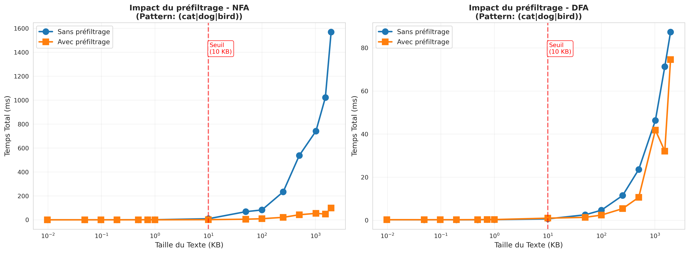

# 4. Résultats et Analyse de Performance

## 4.1. Présentation des Résultats

Les résultats des tests sont issus de la commande `./egrep --test-all --test-folder data --csv report/projet1/performance.csv`. Le fichier `data` contient 9 fichiers de test, le même livre du projet Gutenberg, mais de taille croissante (de 1KB à 2MB). Nous testons les différents algorithmes sur plusieurs scénarios que vous pouvez retrouver dans le fichier `cli/src/test-all.ts`.

## 4.2. Boyer-Moore vs KMP

Les graphiques de la figure \ref{kmp_boyer} compare le temps de matching de KMP et Boyer-Moore pour des patterns littéraux de longueur variable. On observe bien que KMP est plus rapide que Boyer-Moore pour des patterns courts, mais que la situation inverse se produit pour des patterns longs. Cela justifie notre choix de KMP pour les patterns courts et Boyer-Moore pour les patterns longs.

## 4.3. Structure de l'automate: intérêt de la minimisation

Les graphiques de la figure \ref{structure_size} compare la taille de la structure des automates NFA, DFA et min-DFA en moyenne sur les différents scénarios. On observe que le NFA est toujours plus grand que le DFA, qui lui est lui-même plus grand que le min-DFA. Cela confirme l'intérêt de la minimisation pour réduire la taille de la structure.

Cependant, la taille du DFA est souvent très proche de la taille du DFA minimisé, au vu de la complexité de l'algorithme de minimisation, il est possible de discuter de son interêt. Dans notre choix automatique, nous avons décidé de toujours opté pour un min-DFA car nous utilisons une structure DFA que si le text est assez grand pour ammortir le coût de construction.

Il est aussi nécessaire de mentionner que pour certain patternes, il peut arriver que le DFA soit une très mauvaise solution. Par exemple, pour des patterns contenant beaucoup d'alternations après une étoile, le nombre d'états du DFA peut exploser exponentiellement. Cela est le cas pour le scénario "Edge Case - DFA Exponential Blowup" affiché sur la figure \ref{dfa_exponential} qui contient 12 groupes alternatifs, nous nous retrouvons avec un DFA de 4097 états contre 76 pour le NFA.

## 4.4. Impact du préfiltrage

La figure \ref{prefilter} compare le temps de matching avec et sans préfiltrage pour des textes de taille variable pour le NFA et le DFA. 

Pour le NFA, on observe que le préfiltrage améliore les performances dès 10kb de texte, mais que l'impact est plus important pour des textes plus grands.

Pour le DFA, l'impact est moins marqué, mais on observe quand même une amélioration significative pour des textes de plus de 100kb.

## 4.5. Choix d'algorithme selon la taille du texte

La figure \ref{automata_comparison} compare le temps de matching de différents algorithmes selon la taille du texte.

Nous observons que dans notre implémentation le dfa est souvent plus rapide que le nfa, ce qui est cohérent avec la complexité des algorithmes. 
Pour des très petit textes (< 1kb), le coût de construction du min-dfa peut ne pas être amorti mais généralement DFA reste toujours la meilleure solution par rapport au NFA.
